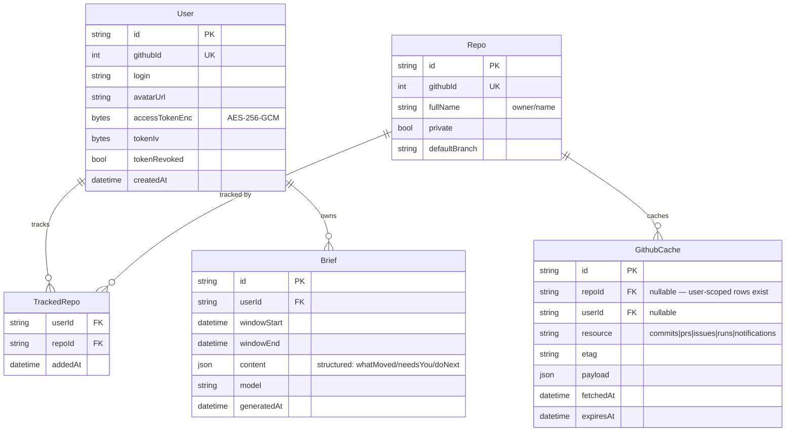
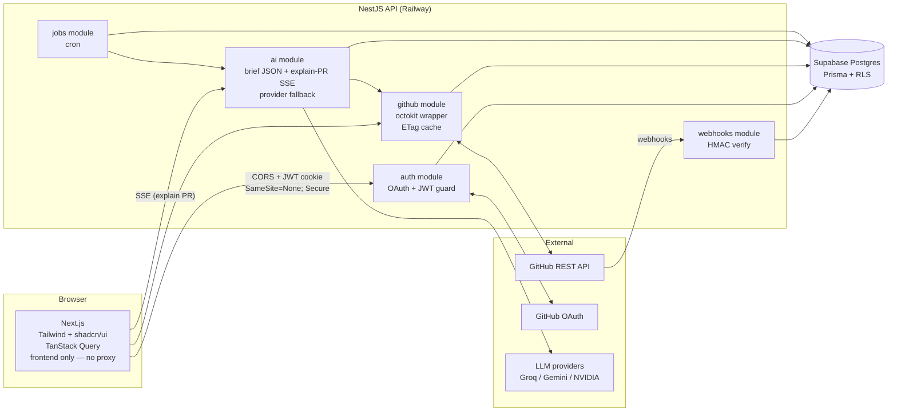
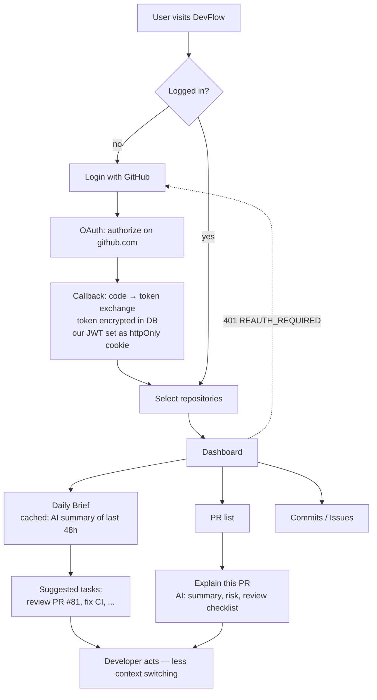
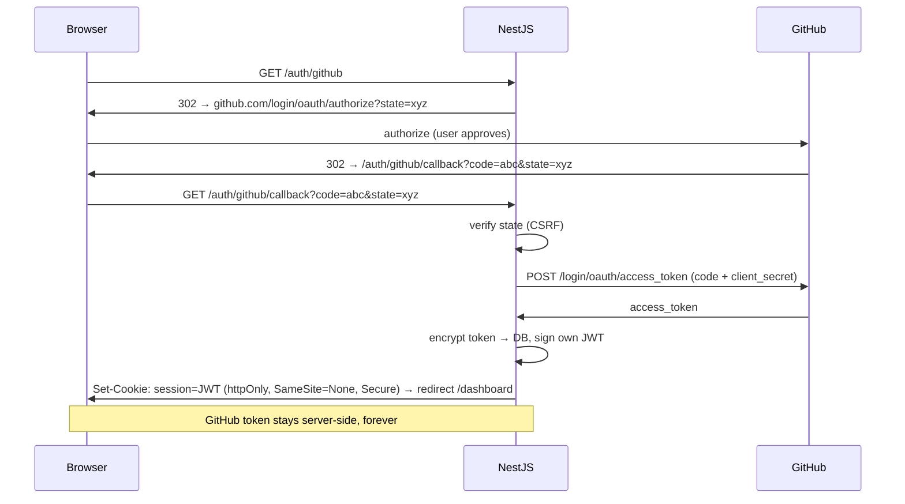
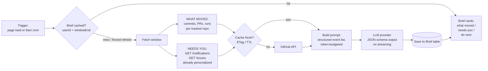

# DevFlow AI — Learning-First Build Plan

AI Engineering Command Center. GitHub tells you what happened; DevFlow tells you what to do next.

> **Learning is the goal.** Ship a real product, but every phase is chosen because it teaches something that transfers.

---

## Working experience (what the user actually gets)

One line: **GitHub answers "what exists?" — DevFlow answers "what do I do now?"**
GitHub is a filing cabinet you dig through. DevFlow is a teammate who read everything overnight and tells you where to point your attention.

### First time
1. Land on DevFlow → one button: **Login with GitHub**.
2. GitHub asks to allow read access to repos → approve.
3. Pick which repos to track (e.g. your team's 3 repos).
4. Dashboard loads.

### Every morning (the core product)
Open DevFlow **instead of** GitHub. Top of screen = your **Daily Brief**:

```
Good morning. Here's what happened since yesterday.

WHAT MOVED
• 12 commits across api-server (payment gateway merged)
• 3 PRs merged, 2 still open
• CI failed on main last night — build step

NEEDS YOU
• PR #81 waiting on YOUR review (3 days old)
• Issue #44 assigned to you — "billing bug", labeled urgent
• You were @mentioned in PR #77

DO NEXT
1. Fix the CI failure (blocks everyone)
2. Review PR #81 (teammate blocked on you)
3. Continue billing bug #44
```

30 seconds → you know the state of everything. No opening 6 GitHub tabs.

### During the day
- **Stuck on a PR?** Click it → **Explain this PR** → AI reads the diff and returns: what it changes, risky files, what could break, a review checklist. Review in 2 min, not 15.
- **What changed?** Commit list with an AI summary on top — "payment done, billing bug fixed, analytics started" instead of reading 20 commit messages.
- **CI red?** Shows the failure and (later) explains *why*.

### What makes it personal
The brief is filtered to **you** — your reviews, your assignments, your @mentions, your CI failures. Two people on the same repo get different briefs. Not a repo dashboard — *your* auto-generated morning standup.

### Core loop
**Open → read brief → act on top task → done.** PR explorer, commit timeline, issues are all there when you drill in, but the brief is the front door and the whole point.

---

## Core decisions (and why)

| Decision | Choice | Why (learning) |
|---|---|---|
| Architecture | **Next.js (frontend) + NestJS (backend API)** | Next.js = UI/SSR/routing only; NestJS = all real backend. Teaches CORS, API design, service separation |
| Transport | **Browser → NestJS direct, cross-origin, from day 1** | CORS + cross-site cookies learned while it's cheap to get wrong |
| Auth | **GitHub OAuth App, hand-rolled** (no NextAuth) | Understand OAuth2 code flow once = understand every auth lib forever |
| DB | **PostgreSQL (Supabase) + Prisma + RLS** | Token storage, API cache, brief cache; Supabase adds row-level security as a DB-enforced auth lesson |
| AI | **Free keys: NVIDIA + Gemini + Groq** (reuse swipe-bot keys) | Structured output, streaming, token budgeting; provider fallback on 429 |
| Build order | **Thin vertical slice first**, then deepen | Integration pain surfaces early, when cheap |

**Security rule #1:** GitHub access token never reaches the frontend. Backend proxies all GitHub calls. Frontend only ever holds our own session JWT (httpOnly cookie).

### Next.js + NestJS split (no proxy layer)

- **Next.js** = frontend only. Pages, UI, TanStack Query. **No route handlers, no proxy, no business logic.** Every data call goes straight to NestJS.
- **NestJS** = all real backend. OAuth, GitHub API, AI, webhooks, jobs, DB.
- **Do NOT** move OAuth into Next.js (NextAuth temptation) — hand-rolled OAuth in NestJS is the core auth lesson.
- **Do NOT** build a Next.js proxy "for now". A proxy today means every fetch path, cookie flag and CORS header gets rewritten later, during deploy week. Learn CORS on day 1 instead:
  - dev: `localhost:3000` (FE) → `localhost:4000` (BE), `credentials: 'include'`, CORS `origin` allowlist + `credentials: true`
  - cookie: `SameSite=None; Secure; HttpOnly` everywhere (dev over `https` via mkcert, or `SameSite=Lax` only if same-site dev is unavoidable)
  - prod is then the same topology with different origins — a config change, not a migration.

### Auth decision: OAuth App (not GitHub App)

| | OAuth App **(chosen)** | GitHub App |
|---|---|---|
| Scope | `repo` = read+write on all repos | per-repo install, fine-grained |
| Token lifetime | does not expire | user token expires 8h, **needs refresh flow** |
| Rate limit | 5000/hr per user | 5000/hr per installation |
| Webhooks | manual per repo | built in |

OAuth App chosen: simplest path to the auth lesson, no refresh-token machinery in Phase 1. Accepted cost: broad `repo` scope on the consent screen, manual webhook setup in Phase 5. GitHub App is the correct end state (fine-grained scope, webhooks free) — revisit after Phase 5.

**Revocation is not optional.** A non-expiring token still dies: user revokes the app, changes password, or GitHub invalidates it. Handle it in Phase 1, not later:
- any GitHub call returning **401** → mark the user's token dead in DB, clear session cookie, return `401 REAUTH_REQUIRED`
- frontend sees `REAUTH_REQUIRED` → bounce to `/auth/github` (re-consent, new token)
- **403 with `x-ratelimit-remaining: 0`** is rate limit, not revocation — do not log the user out for it. Different branch.

---

## Data model (build this before Phase 1)

Five tables. Written down first so Phase 4 isn't a migration rewrite.



Notes:
- `TrackedRepo` is the join — repos are shared rows, tracking is per user.
- `GithubCache` unique on `(userId, repoId, resource)`; `etag` feeds conditional requests, `expiresAt` is the TTL.
- `Brief` unique on `(userId, windowEnd)` — that uniqueness *is* the cache key. See Phase 4.
- Token stored encrypted (AES-256-GCM, key from env). Round-trip encrypt/decrypt gets one assert-level test — it fails silently otherwise.
- **RLS (Supabase):** enable on all 5 tables. Auth is hand-rolled (own JWT), not Supabase Auth, so `auth.uid()` is null — policies use `current_setting('app.user_id')` instead, set per request via `SET LOCAL` in a Prisma middleware/transaction wrapper. Table policy shape: `USING (user_id = current_setting('app.user_id')::uuid)`. This is a second, DB-level enforcement layer under the NestJS guards, not a replacement for them.

---

## High-level architecture



---

## App flow (user journey)



---

## OAuth sequence (Phase 1, built by hand)



---

## Daily Brief data flow (Phase 4)



---

## Phases

### Phase 1 — GitHub OAuth by hand (NestJS)
**Build:** `/auth/github` redirect → callback → code-for-token exchange → encrypt + store token → issue own JWT → guards on all routes. CORS + cross-site cookie config. 401 → revocation handling (`REAUTH_REQUIRED`). Prisma schema (the five tables above).
**Learn:** OAuth2 authorization-code flow, `state` param (CSRF), access token vs session JWT, NestJS guards/interceptors, httpOnly + `SameSite=None; Secure` cookies across origins.
**Gotchas:**
- register OAuth app callback URL per environment (localhost + prod) early
- **Supabase needs the pooled connection string** (Supavisor, port `6543`) for the app; a direct connection on port `5432` is needed for migrations — two URLs in env, not one. This bites at first deploy; set it up on day 1.
- **Prisma 7 removed `url`/`directUrl` from the `schema.prisma` datasource block** — CLI now reads its (direct) URL from `prisma.config.ts`; runtime client takes the pooled URL via a driver adapter (`@prisma/adapter-pg`), not the schema file. Confirm the installed `prisma` version before following older tutorials that show `directUrl` in `schema.prisma` — that shape is Prisma 6 and earlier only.
- **Free-tier project auto-pauses after 7 days with no activity** — needs manual unpause from the Supabase dashboard. Irregular learning-project usage will hit this; don't mistake it for a bug.
- RLS policies use `current_setting('app.user_id')`, not `auth.uid()` — see Data model notes. Wrap Prisma calls in a transaction that runs `SET LOCAL app.user_id = $1` first, or every table returns zero rows.
- distinguish 401 (revoked → logout) from 403 + `x-ratelimit-remaining: 0` (rate limit → back off). Logging users out on rate limit is the classic bug here.

### Phase 2 — GitHub API layer
**Build:** `github` module wrapping octokit: repos, commits, PRs, issues, workflow runs, **notifications**. DTOs for clean responses. `GithubCache` writes with ETag + TTL.
**Learn:** pagination (Link headers), rate limits (5000/hr core, **30/min search** — separate pool), **ETag conditional requests (304s don't count against rate limit)**, cache table with TTL, separating third-party client from domain API.
**Gotchas:**
- naive dashboard = 15 API calls per load. Caching is the lesson, not polish.
- Octokit does **not** send `If-None-Match` for you — conditional requests need explicit wiring. Budget an evening.
- ETags save rate limit, not latency. The felt speed win comes from the DB cache.

### Phase 3 — Frontend dashboard
**Build:** repo list, repo detail, PR list, commit timeline. Skeletons, empty states, error boundaries.
**Learn:** TanStack Query properly — staleTime, invalidation, dependent queries, infinite scroll, `credentials: 'include'` on every call.
**Gotcha:** design loading/empty/error states first. Real repos have 0 PRs sometimes.

### Phase 4 — AI layer (the differentiator)
**Build:**
- **Daily Brief** — personalized from day one, cached from day one.
  - *WHAT MOVED* — repo-wide: commits, PRs, workflow runs across tracked repos (Phase 2 data).
  - *NEEDS YOU* — from `GET /notifications` (@mentions, review requests, assignments, CI failures — already filtered to you, already deduped, has `since`) and `GET /issues` (everything assigned to you, across all repos, one call). This is a *cheaper data source*, not a filter layer over repo-wide data.
  - *DO NEXT* — LLM ranks the merged set.
  - **Caching is part of the feature, not an optimization.** Write to the `Brief` table keyed `(userId, windowEnd)`. Page load reads the row. Regenerate only on: explicit refresh, the 8am cron, or webhook invalidation (Phase 5). Without this, every refresh burns free-tier quota and adds seconds of dead air.
- **Explain PR** — diff → summary, risk, breaking changes, review checklist.

**Learn:**
- Structured output (JSON schema mode) — brief renders as cards, not a markdown blob
- Token budgeting — big diffs don't fit; select files by size/relevance
- **SSE streaming** NestJS → React
- Prompt iteration against real repo data
- Using OAuth identity to shape data; GitHub's already-personalized endpoints

**Streaming split — deliberate:**
- **Brief: JSON schema, no streaming.** Streaming a JSON blob token-by-token yields partial invalid JSON — nothing renders until the last token anyway. All the complexity, none of the perceived speed. Groq returns the whole object in ~1–2s, and it's cached after that.
- **Explain PR: SSE text streaming.** Prose, interactive, first-token-latency actually matters. This is where the streaming lesson lives.

**Provider handling — config map, not an interface:**
Groq and NVIDIA NIM are both OpenAI-compatible → one `openai` SDK client, different `baseURL` / `apiKey` / `model`. Gemini is the only one needing its own call shape.
```
providers = [
  { name: 'groq',   baseURL, apiKey, model },   // fastest
  { name: 'nvidia', baseURL, apiKey, model },   // same client, different config
  { name: 'gemini', custom }                    // biggest context
]
```
Loop them, catch 429/5xx, fall through to the next. ~10 lines. No `LlmProvider` interface until Gemini's differences actually hurt — an interface with one real implementation and one adapter is ceremony.
**Also:** free-tier models return malformed JSON more often than you'd like. Retry once on parse failure, then degrade to a raw-text card. Don't let a bad token kill the whole brief.

**Gotcha:** a quiet repo produces a dead-looking brief. Keep a seeded fixture repo with real activity (commits, an open PR, a deliberately failing CI run) for development and screenshots.

### Phase 5 — Webhooks + background jobs
**Build:** GitHub webhook receiver (push/PR events) with **HMAC signature verification** → invalidate `GithubCache` rows → mark affected users' briefs stale. Cron for the 8am brief.
**Learn:** webhooks vs polling, idempotency, cache invalidation as a first-class concern. This phase = "backend engineer" on the resume.
**Gotchas:**
- local dev needs a tunnel — `smee.io` or ngrok.
- **queue only if queues are the lesson.** One cron job does not need BullMQ + Redis (another service, another bill). Start with `node-cron` or the platform's cron. Add BullMQ when there's real fan-out (per-user brief generation across many users) — then it's justified, and you'll actually feel why.
- HMAC verify needs the **raw** body. Nest's JSON body parser eats it — configure a raw-body route or verification silently always fails. Worth one assert-level test.

### Phase 6 — Deploy + polish
**Build:** Vercel (FE) + Railway (BE) + Supabase. Logging, error handling, mobile pass.
**Learn:** secrets per environment, prod CORS origin allowlist, cross-origin cookies in the wild.
**Note:** because transport was cross-origin from day 1, this phase is a config change, not a migration. That's the point.

### Stretch (pick one)
- **RAG repo Q&A** ("where is auth handled?") — embed file tree + key files, retrieve, answer. First RAG build.
- **Migrate to a GitHub App** — fine-grained scopes, webhooks built in, installation tokens + refresh flow. The auth lesson, part two.
- GitHub GraphQL — one query replacing 5 REST calls.
- Repo health score — fun, low learning value, last.

---

## Build order

Thin vertical slice first: **Phase 1 → Phase 2 (thin) → Phase 4 (thin) → working end to end.** Dashboard depth, webhooks and polish come after. AI is the centerpiece, never a should-have — without it this is just another GitHub dashboard.

---

## Skills walked away with

OAuth internals · third-party API integration with caching + rate limits · TanStack Query · structured LLM output + SSE streaming · webhooks + cache invalidation · multi-service deploy with real CORS.
